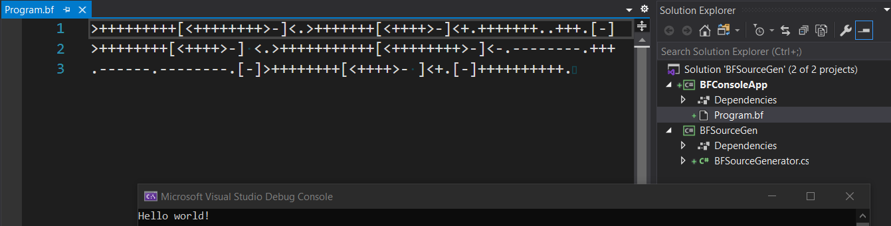

# BFSourceGen
Ever wanted to write a C# console app in BrainF**k? Well now you can!

Thanks to C# Source Generators, at compile time we convert our BF to C#, and then compile that!

##  .bf options:

| Flag Example | Description                        | Valid Values                          | Default Value |
|--------------|------------------------------------|---------------------------------------|---------------|
| #memsize=100 | Sets the size of the memory array  | > 0                                   | 1024          |
| #memtype=int | Sets the type for the memory array | _byte_, _int_, _long_                 | int           |
| #eofvalue=-1 | Sets the End of File value         | _same_, or any valid value of memtype | 0             |