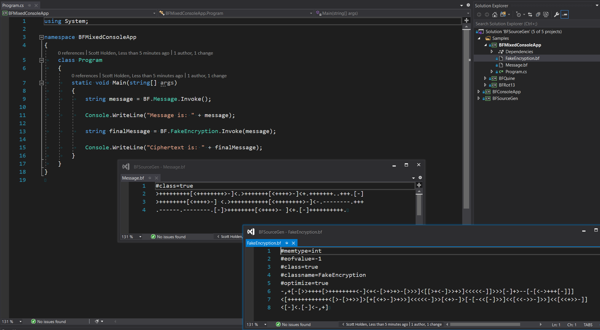
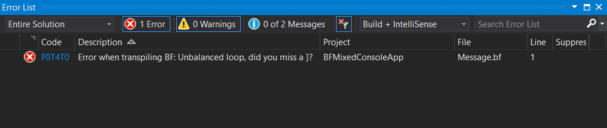

# BFSourceGen
Ever wanted to write a C# console app in BrainF**k? Well now you can!

Thanks to C# Source Generators, we can now convert our BF to C#, and then compile it!

Ever had a piece of business logic or home-rolled insecure encryption that was too simple to work on and understand in C#? This is the answer. You can also mix up your projects, calling BF code whenever you want!

If your BF code reads input, we'll ask for a parameter, if it has output, we'll return a string. You can even write parameterless void BF code where the only side-effects are CPU heat & processing time!!!

We can even optimize if required (clumping together adjacent op's), but it's **totally optional** and **turned off by default**! Live the true BF experience in having every individual increment & decrement call map to an individual operation.

With minimal error checking, you can be sure that we will only tell you if something is critically wrong.

Finally, everyone loves magic code that performs a crucial operation, is never documented in the readme, and the author just assumes you should know what to do. An example of this is class names that are not explicitly defined, or mystical namespaces. Good luck.

##  .bf options:

| Flag Example | Description                        | Valid Values                          | Default Value |
|--------------|------------------------------------|---------------------------------------|---------------|
| #memsize=100 | Sets the size of the memory array  | > 0                                   | 1024          |
| #memtype=int | Sets the type for the memory array | _byte_, _int_, _long_                 | int           |
| #eofvalue=-1 | Sets the End of File value         | _same_, or any valid value of memtype | 0             |
| #optimize=true | Turns on optimization at compile time |  _true_, _false_, or a flag without a value is treated as true | false |
| #class=true | Instead of emitting an entry-point, just make it a normal class |  _true_, _false_, or a flag without a value is treated as true | false |